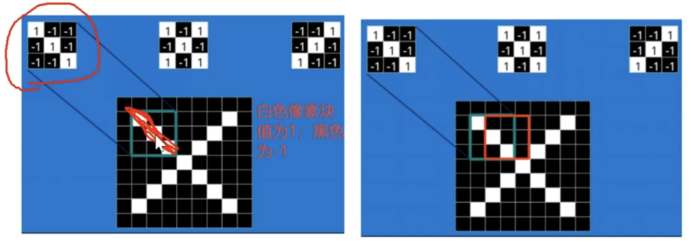
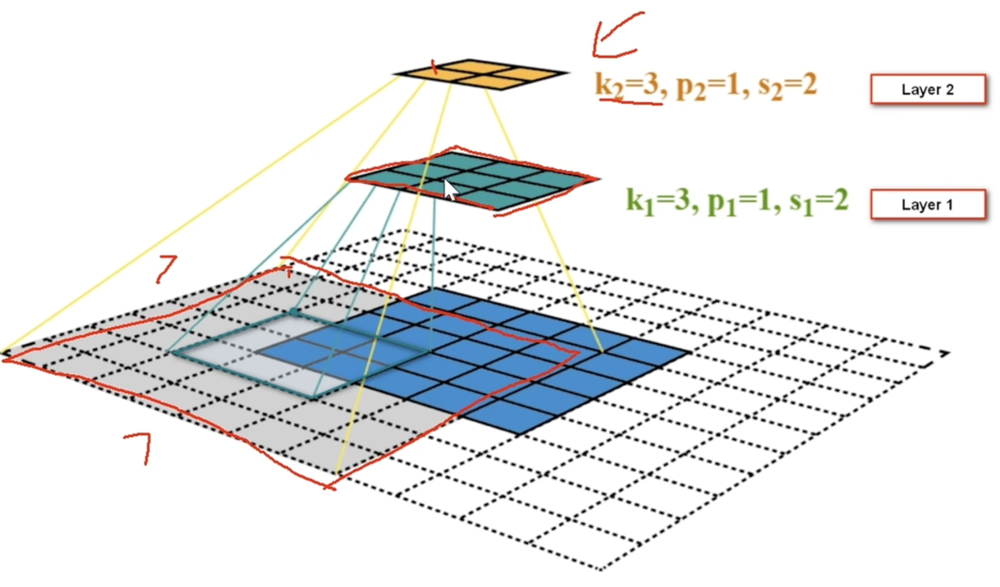

# CNN Notes

## 基本步骤
### 1.数据处理
- 归一化：将像素值缩放到 0-1 或 - 1 到 1 
- 填充padding：边缘添加空白像素点

``` python
# 定义预处理：转Tensor + 归一化（像素值缩到 [0,1] 再标准化到 [-1,1]）
transform = transforms.Compose([
    transforms.ToTensor(),
    transforms.Normalize((0.5,), (0.5,))  # 单通道灰度图，均值和方差都是0.5
])

# 加载数据集（以MNIST为例）
train_dataset = datasets.MNIST(root='./data', train=True, download=True, transform=transform)
test_dataset = datasets.MNIST(root='./data', train=False, download=True, transform=transform)

# 创建DataLoader（批量加载数据）
train_loader = DataLoader(train_dataset, batch_size=64, shuffle=True)
test_loader = DataLoader(test_dataset, batch_size=64, shuffle=False)
```

### 2.卷积层  
- 卷积核（过滤器）：有多个，每个输出一张特征图，多个卷积核提取不同的特征

- 多通道：RGB每一个通道都要一个卷积核

- 步长stride：卷积核每次滑动的距离

- 感受野：层数越深，每一个点能看到的原始图像范围越广。



### 3.激活函数层
- 作用：引入非线性，模拟神经元开启阈值。

### 4.池化层（特征的汇聚）

**作用**：降维但是对特征的损失很小。保留重要特征。保证**平移不变形**。
- mean池化
- max池化


### 5.重复堆叠（可选）

- 通常会堆叠多组 “卷积 + 激活 + 池化” 层，逐步提取更高级的抽象特征（比如从边缘→形状→物体部件）。

计算输出图尺寸的公式（$dilation=0$）
$$H_{out} = \frac{H_{in}+2P-K}{S}+1$$
- $H_{out}$:输入高度; 计算宽度时，$H$换成$W$
- $P$:padding大小
- $K$:卷积核大小
- $S$:步长

```python
# --- 卷积层1 + 激活 + 池化 ---
        self.conv1 = nn.Conv2d(
            in_channels=1,   # 输入通道数（灰度图=1，RGB图=3）
            out_channels=16, # 输出通道数（卷积核数量）
            kernel_size=3,   # 卷积核大小 3x3
            stride=1,        # 步长
            padding=1        # 填充（保持输入输出尺寸一致）
        )
        self.relu1 = nn.ReLU()
        self.pool1 = nn.MaxPool2d(kernel_size=2, stride=2) # 最大池化，2x2，相当于图的尺寸变为1/2
```

```python
# --- 卷积层2 + 激活 + 池化 ---
        self.conv2 = nn.Conv2d(
            in_channels=16,  # 输入通道数=上一层输出通道数
            out_channels=32, 
            kernel_size=3, 
            stride=1, 
            padding=1
        )
        self.relu2 = nn.ReLU()
        self.pool2 = nn.MaxPool2d(kernel_size=2, stride=2)
```

### 6.全连接层
- 将最后一层的特征图展平成一维向量。
```python
self.flatten = nn.flatten()
```
- 通过全连接层将提取的特征映射到输出空间（比如分类任务的类别概率）。

### 7.输出层

- 分类任务：用Softmax输出每个类别的概率。
- 二分类任务：可用Sigmoid输出 0-1 之间的概率值。

```python
# --- 全连接层（分类头）---
        self.fc1 = nn.Linear(32 * 7 * 7, 128) # 输入维度=通道数*特征图尺寸
        self.relu3 = nn.ReLU()
        self.fc2 = nn.Linear(128, 10) # 输出10个类别（MNIST 0-9）
```