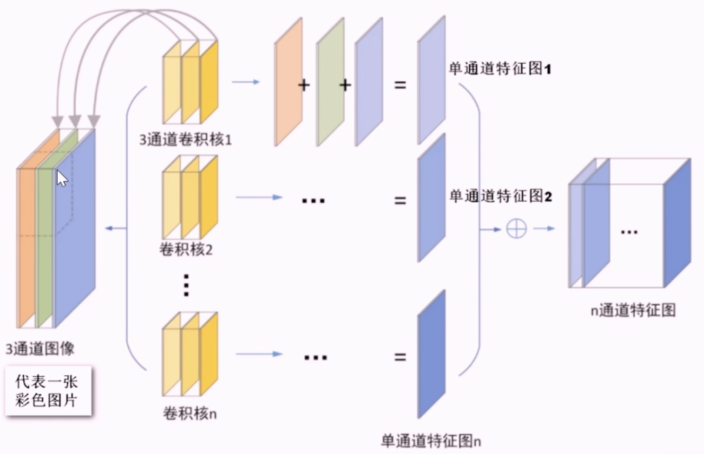

# CNN Notes

## 基本步骤
1.数据处理
- 归一化：将像素值缩放到 0-1 或 - 1 到 1 
- 填充padding：边缘添加空白像素点

2.卷积层  
- 卷积核：有多个，每个输出一张特征图，多个卷积核提取不同的特征
- 多通道：RGB每一个通道都要一个卷积核

- 步长stride：

3.激活函数层

4.池化层

5.重复堆叠（可选）

6.全连接层

7.输出层

